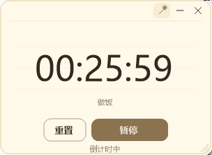

# DeskPing

<div align="right">**简体中文** · [English](README.en.md)</div>

<p align="center">
  <strong>一个安静待在桌面角落、到点时认真提醒你的 Windows 计时器。</strong>
</p>

<p align="center">
  正计时 · 倒计时 · 目标时刻 · 每日重复 · 托盘常驻 · 中英文切换
</p>

<p align="center">
  
  
  
  
</p>

## 界面一览

| 倒计时 | 正计时 | 目标时刻 |
| :-: | :-: | :-: |
|  |  |  |

## 功能

| 模式 | 说明 |
| :--- | :--- |
| **正计时** | 从零开始累计，适合专注时长、通勤、健身等 |
| **倒计时** | 设定时长（时:分:秒直接输入），归零即提醒 |
| **目标时刻** | 设定时刻（今天 / 明天 / 自定义日期），到点提醒；支持**每日重复** |

三种模式下方都有一个**备注框**。开始计时后，备注会作为当前事项显示在时间下方；到点提醒时也会一起显示。

> 开始计时后设置区自动收起，只保留计时内容；点「重置」即可重新设置。会话内容不会持久保存，每次启动都是新的计时。

### 到点提醒

- 窗口自动弹出并置顶
- 数字上下跳动 + 边框呼吸闪动
- 任务栏图标闪烁
- 提示音（可关闭）
- 托盘气泡提醒
- 点击「知道了」后停止动画并复位

### 窗口与托盘

- **托盘常驻**：双击图标显示 / 隐藏，右键菜单可操作主要功能
- **窗口置顶**：标题栏图钉或托盘菜单均可切换
- **自由缩放**：拖动窗口边角调整大小，数字同步缩放
- **关闭不退出**：点击 `×` 只隐藏到托盘
- **设置自动保存**：主题、语言、声音、置顶等设置会保留

### 语言与主题

应用默认中文，可在托盘菜单中即时切换为 English。

主题支持：**暖纸 / 墨 / 林 / 霞**，并提供深色模式。

## 功耗设计

- 计时核心使用单个 **1Hz 节拍器**，无忙轮询
- 空闲状态 CPU 占用接近 0%
- 窗口隐藏时不刷新 UI
- 动画仅在到点提醒期间运行
- GDI+ 按需绘制，无常驻渲染管线

## 使用

1. 启动 `DeskPing.exe`。
2. 选择正计时、倒计时或目标时刻。
3. 可填写备注并开始计时。
4. 右键托盘图标可切换语言、主题、置顶、提醒音、开机自启等设置。

设置保存在：

```text
%APPDATA%\DeskPing\settings.json
```

## 构建

需要 [.NET 10 SDK](https://dotnet.microsoft.com/download)。

```sh
dotnet build -c Release
```

| 脚本 | 产物 | 说明 |
| :--- | :--- | :--- |
| `publish.cmd` | `publish\DeskPing.exe` | 体积较小，需要目标机器安装 .NET 10 Desktop Runtime |
| `publish-self-contained.cmd` | `publish-self-contained\DeskPing.exe` | 自带运行时，可直接运行 |

## 技术栈

`C#` · `.NET 10` · `WinForms` · `GDI+` · `Windows Tray API`

## License

[MIT](LICENSE)
